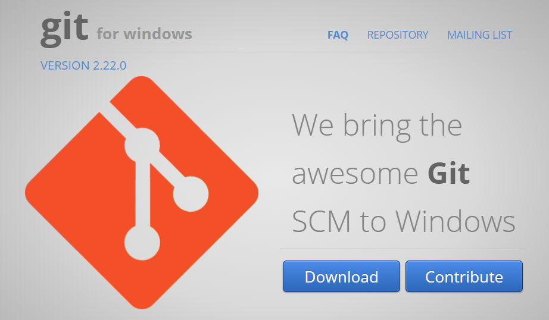
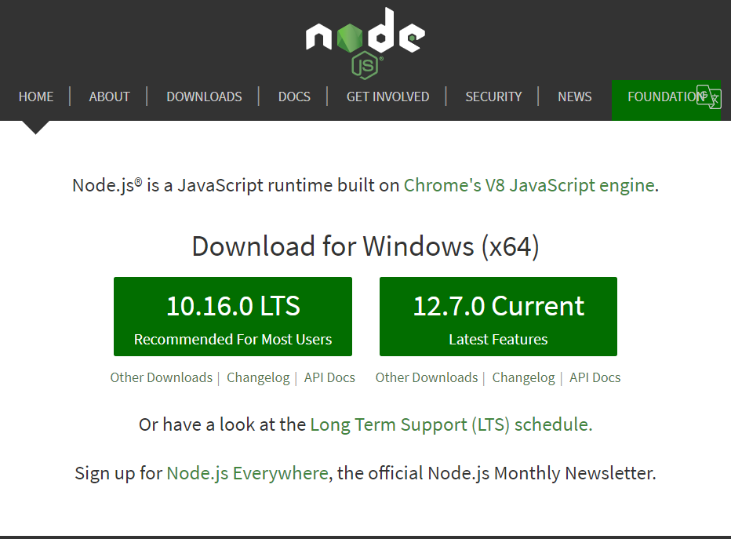
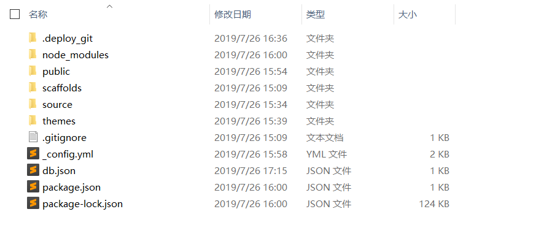
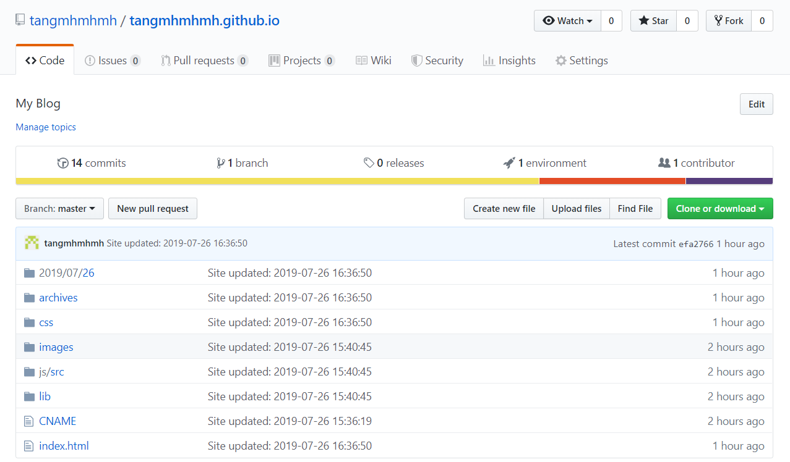
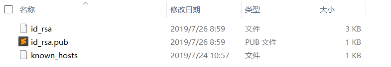
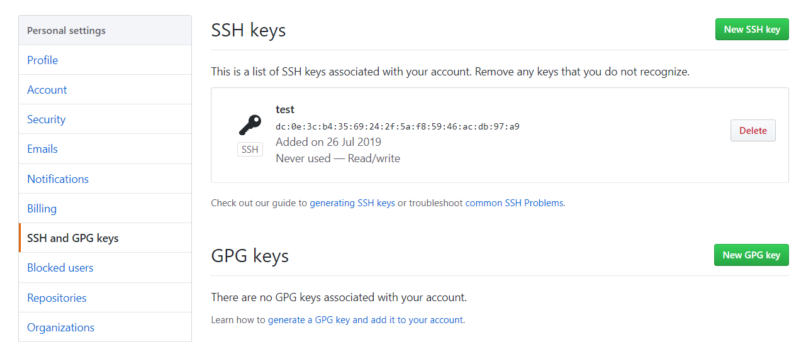

---

title: hexo-github搭建个人博客
date: 2019-07-26 17:15:26
tags: [hexo,站点配置]
category: [hexo,站点配置]
---

转载自http://visugar.com/2017/05/04/20170504SetUpHexoBlog/，并加了一些其他东西。

# 前期准备

前期准备主要时安装三个东西：git bash、NodeJs、hexo

## git bash安装

git bash 直接下载安装即可，下载地址：https://gitforwindows.org/



一路next就完事了

## NodeJs安装

Hexo是基于nodeJS环境的静态博客，里面的npm工具很有用啊，所以还是老老实实把这玩意儿装了吧

下载地址：https://nodejs.org/en/



LTS为长期支持的版本，Current为最新版本

注意：安装中直接一路next就好了，注意添加到系统目录

## hexo安装

打开git bash ,安装hexo，安装命令：

```c
npm i -g hexo
```

进入目标文件夹，初始化，命令：

```c
hexo init
```

或在上一级文件夹初始化：

```
hexo init "文件夹名称"
```

初始化之后博客文件夹里出现了很多文件夹和文件：



1. node_modules：是依赖包
2. public：存放的是生成的页面
3. scaffolds：命令生成文章等的模板
4. source：用命令创建的各种文章
5. themes：主题
6. _config.yml：整个博客的配置
7. db.json：source解析所得到的
8. package.json：项目所需模块项目的配置信息

# 搭建过程

搭建过程主要是三步：

生成SSH，项目部署，上传到github

## 生成SSH并添加到github

创建一个repo，名称为`yourname.github.io`, 其中yourname是你的github名称，按照这个规则创建才有用。



回到gitbash中，配置github账户信息（YourName和YourEail都替换成你自己的）

创建SSH

在gitbash中输入：`ssh-keygen -t rsa -C "youremail@example.com`，生成ssh。然后按下图的方式找到`id_rsa.pub`文件的内容。



生成的文件在用户根目录下的.ssh文件夹中。

将上面获取的ssh放到github中：

用户设置->SSH and GPG keys->New SSH key

在gitbash中验证是否添加成功：`ssh -T git@github.com`

## 部署项目

用编辑器打开你的blog项目，修改`_config.yml`文件的一些配置(冒号之后都是有一个半角空格的)：

```C
deploy:
  type: git
  repo: https://github.com/YourgithubName/YourgithubName.github.io.git
  branch: master
```

回到gitbash中，进入你的blog目录，分别执行以下命令：

```C
hexo clean
hexo generate
hexo server
```

注：hexo 3.0把服务器独立成个别模块，需要单独安装：`npm i hexo-server`

## 上传到github

先安装一波：`npm install hexo-deployer-git --save`（这样才能将你写好的文章部署到github服务器上并让别人浏览到）

执行命令(建议每次都按照如下步骤部署)：

```C
hexo clean
hexo generate
hexo deploy
```

在浏览器中输入`http://yourgithubname.github.io`就可以看到你的个人博客啦，是不是很兴奋！

# 个性化设置

个性化配置可选项很多，这里想到什么就说什么了

## 正常渲染公式

1. 更新公式选然引擎

   ```C
   npm uninstall hexo-renderer-marked --save
   npm install hexo-renderer-kramed --save
   ```

   再安装一个自动部署MathJax的hexo插件。安装方式也很简单，在博客文件夹下执行：

   ```c
   npm install hexo-math --save
   hexo math install
   ```

2. 修改配置文件

   目标文件：**node_modules\kramed\lib\rules\inline.js**

   第11行：

   ```js
   //  escape: /^\\([\\`*{}\[\]()#$+\-.!_>])/,
     escape: /^\\([`*\[\]()#$+\-.!_>])/
   ```

   第20行：

   ```js
   //  em: /^\b_((?:__|[\s\S])+?)_\b|^\*((?:\*\*|[\s\S])+?)\*(?!\*)/,
     em: /^\*((?:\*\*|[\s\S])+?)\*(?!\*)/
   ```

3. 在主题中打开mathjax开关

   找到具体theme的**_config.yml**文件，把mathjax的false改成true

   ```yml
   # MathJax Support
   mathjax:
     enable: true
     per_page: true
   ```

4. 最后一步：

   每次需要用到公式时需要在文章开头打开mathjax开关：

   ```yml
   title: index.html
   date: 2016-12-28 21:01:30
   tags:
   mathjax: true
   ```

   

## 首页文章以摘要形式显示

打开具体主题配置文件，找到**auto_excerpt:**

```yaml
auto_excerpt:
  enable: true
  length: 150
```

其中`length`代表显示摘要的截取字符长度

## 添加头像

添加头像是需要在具体theme中操作的，因此首先需要切换到具体theme文件夹中，整个过程分三步：

1. 将头像放在**./theme/具体theme/source/image/**目录下，例如图像名为head.jpg

2. 在对应主题文件夹下找配置文件_config.yml，修改avatar:

   ```c
   avatar: /images/head.jpg
   ```

3. 修改**\themes\next\source\css\_common\components\header**下的header.styl中的第一行：

   ```c
   .header { background: url('../image/header.jpg'); }
   ```

最后重新上传，就好了。


## 绑定域名

添加CNAME：在项目的source文件夹下新建一个名为CNAME的文件，在里面添加你购买的域名，比如我添加的是`visugar.com`，只能添加一个

## 修改主题

hexo初始化之后默认的主题是`landscape` , 然后你可以去[这个地址](https://hexo.io/themes/)里面找到你想要的主题。在github中搜索你要的主题名称，里面都会有该主题的如何使用的介绍，按着来就好了，反正就是改改改！。

修改主题分为两步：

1. 将主题下载到./theme文件夹下

2. 修改_config.yml文件中的theme选项

   ```
   theme: next
   ```

# 使用

## 写文章

推荐使用Typora

新建文章：

```
hexo new '文章名'
```

然后你就可以在`source/_posts`路径下看到你创建的文章啦，编辑完成之后按照前面说的方式部署，在浏览器刷新就能看到你的文章了。