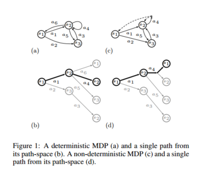

> Ziebart B D, Maas A, Bagnell J A, et al. Maximum entropy inverse reinforcement learning[J]. 2008.

# 作者信息

| 作者             | 学校/机构                    |
| ---------------- | ---------------------------- |
| Brian D. Ziebart | 卡内基梅隆大学计算机科学学院 |
| Andrew Maas      | 卡内基梅隆大学计算机科学学院 |
| J.Andrew Bagnell | 卡内基梅隆大学计算机科学学院 |
| Anind K. Dey     | 卡内基梅隆大学计算机科学学院 |

# 摘要

最近的研究表显示了模仿学习问题的框架用来解决马尔可夫决策问题的优势。这种方法将学习简化为恢复一个效用函数的问题，该函数使由接近最优策略引起的行为与演示的行为非常相似。在这项工作中，我们开发了一种基于最大熵原理的概率方法。我们的方法提供了明确的，全局标准化的决策序列分布，同时提供与现有方法相同的性能保证。

我们在建模现实世界导航和驾驶行为的背景下开发我们的技术，其中收集的数据本质上是嘈杂和不完美的。我们的概率方法可以对路径偏好进行建模，并且可以根据部分轨迹推断出目的地和路线的强大新方法。

# 概述

在模仿学习的问题中，目标是学习预测agent将选择的行为和决定, 例如，人们为了抓住物体采用的动作或驾驶员从家到工作的路线。对于通用的统计机器学习算法来说，捕捉有目的的、顺序的决策行为是相当困难的;在这类问题中，算法必须经常对遥远未来的行为后果进行推理。

最近研究模仿学习问题的一个强有力的想法是，将学习策略的空间构造为搜索、规划或更普遍的马尔可夫决策问题(MDP)的解决方案。直观地说，关键的概念是，agent的作用是优化未知的奖励函数(假设特征是线性的)，并且我们必须找到使其演示的行为(接近)最优的奖励权重。然后，模仿学习问题被简化为恢复一个奖励函数，该函数通过搜索算法来“拼接”长而连贯的决策序列，从而优化该奖励函数，从而诱导所演示的行为。

在模拟学习中，我们采用完全概率的方法来推理不确定性。在匹配被证明行为的奖励值的约束下，利用最大熵原理解决了在选择分配时的模糊性。为确定性MDPs的学习和推理提供了有效的算法。我们依赖一个额外的简化假设来使关于非确定性MDPs的推理变得易于处理。所得到的分布是一个概率模型，它对行为进行全局规范化，可以理解为链条件随机场的扩展，它包含了规划系统的动态，并扩展到无限的视界(The resulting distribution is a probabilistic model that normalizes globally over behaviors and can be understood as an extension to chain conditional random fields that incorporates the dynamics of the planning system and extends to the infinite horizon.)。

我们的研究工作的动机是建模驾驶员的实际路线首选项的问题。我们利用收集到的10万英里出租车驾驶GPS数据，将我们的方法应用于路径偏好建模，其中世界的结构(即，即道路网络)是已知的，以及可采取的行动(即，以道路特征(例如车速限制、行车线数目)为特征。与许多模仿学习技术形成鲜明对比的是，我们的有目的行为概率模型与包括隐变量技术在内的其他概率方法无缝集成。这允许我们扩展我们的路线偏好，隐藏目标，以自然推断未来的路线和目的地的部分轨迹。

一个关键的问题是，演示的行为容易产生噪音和不完美的行为。最大熵方法提供了一种处理这种不确定性的原则方法。我们讨论了该技术相对于现有的反向强化学习方法(Ratliff, Bagnell， & Zinkevich 2006)和相对于每个状态可用操作的局部规范化方法(Ramachandran & Amir 2007;Neu & Szepesvri 2007)。

# 背景知识

在模仿学习环境中，agent的行为(即,其轨迹或路径,$ζ$、状态$s_i$和行为$a_i$)在一些规划空间由学习者试图观察模型或模仿代理。假设agent试图优化一些函数，$f_{s_j}\in{R^k}$，这些函数是每个状态的特征和状态奖励值的线性映射，奖励值表示agent达到该状态的有用性。这些函数通过奖励权重系数$\theta$优化。轨迹的奖励值仅仅是状态奖励的和，或者等价地，应用于路径特征的奖励权重计数，$f_ζ=\sum_{s_j\in{ζ}}f_{s_j}$,其为沿路径的状态特征值之和。
$$
reward(f_ζ)=\theta^Tf_ζ=\sum_{s_j\inζ}\theta^Tf_{s_j}
$$
根据很多(m个)轨迹，agent可以演示单一轨迹，$\tilde{ζ}_i$，并具有预期的经验特征数量$\tilde{f}=\frac{1}{m}\sum_if_{\tilde{ζ}_i}$

恢复agent的确切奖励权重是一个不明智的问题;许多奖励权重，包括退化（例如，全零），使得演示的轨迹最佳。Ratliff，Bagnell和Zinkevich（2006）将此问题作为结构化最大边际预测（MMP）之一。他们考虑了一类损失函数，这些函数直接测量代理和已学习策略之间的差异，然后使用结构化边际方法有效地学习基于此损失的凸松弛的奖励函数，并且只需要oracle访问MDP求解器。然而，当没有单一的奖励函数使得证明的行为既优化又明显优于任何替代行为时，该方法存在一些显着的缺点。例如，当代理所演示的行为不完美，或者规划算法只捕获了相关状态空间的一部分，而不能完美地描述所观察到的行为时，这种情况经常发生。

Abbeel＆Ng（2004）提供了一种基于逆向强化学习（IRL）的替代方法（Ng＆Russell 2000）。作者提出了一种在观察到的策略和学习者行为之间匹配特征期望（等式1）的策略;他们证明了这种匹配对于实现与agent相同的性能是必要和充分的，如果代理实际上在这些特征中解决了具有线性奖励函数的MDP。
$$
\sum_{Path_{ζ_i}}f_{ζ_i}=\tilde{f}\tag{1}
$$
不幸的是，IRL概念和特征计数的匹配都是模糊的。对于许多奖励函数(例如，全0)，每个策略都是最优的，并且许多策略会导致相同的特性计数。当表现出次优行为时，需要策略的混合来匹配特征计数，同样，许多不同策略的混合满足特征匹配。没有提出任何方法来解决歧义#。

# 最大熵逆向强化学习

我们采用了一种不同的方法来匹配特性计数，这种方法允许我们以一种有原则的方式处理这种模糊性，并产生一个单一的随机策略。我们利用最大熵原理(Jaynes 1957)来解决选择分布时的模糊性。这一原则将我们引向行为上的分布，这些行为受到约束，以匹配特性期望，同时并不比这个约束要求更多地致力于任何特定的路径。

## 确定性路径分布

与以前的工作不同，我们考虑的是整个类的可能行为的分布。这对应于(潜在的)变量的路径确定性MDPs的长度(图1b)(图1a)。

与策略的分布类似，当所演示的行为不是最优的时，许多不同的路径分布匹配特性计数。这个集合中的任何一个分布都可能表现出对某些路径的偏好，而不是路径特性所暗示的其他路径。我们使用了最大熵原理，它通过选择除了匹配特征期望之外不显示任何额外首选项的分布来解决这种模糊性(公式1)。
结果确定性mdp分布路径是通过奖励权重参数化$\theta$(公式2)。在该模型下，具有相同奖励的计划具有相同的概率，并且具有较高奖励的计划具有指数级的更大的优先级。
$$
P({ζ_i}|\theta)=\frac{1}{Z(\theta)}e^{\sum_{s_j}\in{ζ_i}\theta^Tf_{s_j}}\tag{2}
$$
给定参数权重，分配函数Z（θ）总是收敛于有限地平线问题和无限视界问题与折扣奖励权重(Given parameter weights, the partition function, Z(θ), always converges for finite horizon problems and infinite horizons problems with discounted reward weights.)。对于具有零奖励吸收状态的无限地平线问题，即使所有状态的回报都是负的，分区函数也可能无法收敛。然而，给定所示的轨迹在有限数量的步骤中被吸收，最大化熵的奖励权重必须是收敛的。

## 非确定性路径分布

在一般的MDP中，根据状态转移分布$T$，动作在状态之间产生非确定性转换（图1c）。这些MDP中的路径（图1d）现在由agent的动作选择和MDP的随机结果决定。我们在路径上的分配必须考虑到这种随机性。

我们使用以过渡分布$T$为条件的路径的最大熵分布，并且约束以匹配特征期望（等式1）。考虑行动结果的空间T和结果样本$o$，指定每个动作的下一个状态。对于与$o$兼容的路径（即，路径和匹配的动作结果），先前的分布（等式2）给出了MDP的确定性。当$ζ$与$o$兼容时，指标函数$I_ζ∈o$为1，否则为0。计算这种分布（公式3）通常是难以处理的。然而，如果我们假设转换随机性对行为的影响有限并且分区函数对于所有$o∈T$都是常数，那么我们在路径上获得易处理的近似分布（等式4）。
$$
P(ζ|\theta,T)=\sum_{o\in T}P_T(o)\frac{e^{\theta^T}f_ζ}{Z(\theta,o)}I_{ζ\in o}\tag{3}
$$

$$
P(ζ|\theta,T)\approx\frac{e^{\theta^T}f_ζ}{Z(\theta,o)}\prod_{s_{t+1},a_t,s{t\in ζ}}P_T(s_{t+1}|a_t,s_t)\tag{4}
$$

## 随机策略

这种路径上的分布提供了一个当公式（4）收敛时的随机策略(即，每个状态的可用操作的分布)。某一行动的概率由该行动开始的所有路径的期望指数报酬加权。
$$
P(action a|\theta,T)\propto\sum_{ζ:a\in{ζ_{t=0}}}P(ζ|\theta,T)\tag{5}
$$

## 从示范动作中学习

在受到观测数据特征约束的路径上最大化分布的熵意味着我们在上面导出的最大熵（指数族）分布下最大化观测数据的可能性（Jaynes 1957）。
$$
\theta^*=arg\max_\theta L(\theta)=arg\max_\theta \sum_{examples}logP(\tilde{ζ}|\theta,T)
$$
对于确定性MDPs，该函数为凸函数，利用基于梯度的优化方法可以得到最优解。梯度是期望经验特征数与算法期望特征数之差，可用期望状态访问频率$D_{s_i}$表示。
$$
\nabla L(\theta)=\tilde{f}-\sum_{ζ}P(ζ|\theta,T)f_ζ=\tilde{f}-\sum_{s_i}D_{s_i}f_{s_i}\tag{6}
$$
在最大值处，特征期望匹配，保证学习者的表现与代理的演示行为相当，而不管代理试图优化的实际奖励权重(Abbeel & Ng 2004)。

在实践中，我们测量基于经验的、基于样本的对特征值的期望，而不是要模仿的代理的真实值。假设特征的大小有界,一个标准的联盟和霍夫丁不等式绑定参数可以提供高概率的误差界限功能预期作为样本的数量的函数——特别是,这些边界只有一个$O (log K)$依赖特征的数量(Assuming the magnitude of the features can be bounded, a standard union and Hoeffding bound argument can provide high-probability bounds on the error in feature expectations as a function of the number of samples– in particular, these bounds have only an O(log K) dependence on the number of features.)。Dud'ık＆Schapire（2006）表明，给出特征期望中有界不确定性的最大熵问题是一个最大的后验问题，与上述问题完全相同，但加上了$l_1-regularizer$（正则化的强度取决于 关于该特征期望的不确定性）。在我们的实验部分，我们使用在线指数梯度下降算法，这是非常有效的，并诱导了$l_1$型正则化的系数。

## 有效的状态频率计算

给定期望的状态频率，可以很容易地计算梯度(式6)进行优化。计算期望状态频率的最直接方法是基于枚举每个可能的路径。不幸的是，随着MDP时间范围的指数增长，基于枚举的方法在计算上是不可行的。

算法1：期望边界频率计算

1. 令$Z_{s_i,0}=1$

2.  $Z_{a_{i,j}}=\sum_k P(s_k|s_i,a_{i,j}) e^{reward(s_i| \theta)}Z_{s_k}$

   递归计算N次迭代

   $Z_{s_i}=\sum_{a_{i,j}}Z_{a_{i,j}}$

   局部动作概率计算

3. $P(a_{i,j}| s_i)=\frac{Z_{a{i,j}}}{Z_{s_a}}$

   前向传递

4. 令$D_{s_i,t}=P(s_i=s_{initial})$

5. 递归地计算t = 1到N

   $D_{s_i,t+1}=\sum_{a_{i,j}}\sum_k D_{s_k,t|s_i}P(a_{i,j})P(s_k|a_{i,j},s_i)$

   累加频率

6. $D_{s_i}=\sum_t D_{s_i,t}$

相反，我们的算法使用一种类似于条件随机域的前向-后向算法或强化学习中的值迭代的技术，有效地计算期望状态占用频率。该算法利用一个大的固定时间域逼近无限时间域的状态频率。它递归地从每个可能的终端状态“备份”(步骤1)，并通过计算方程4在每个动作和状态下的配分函数计算与每个分支关联的概率质量(步骤2)。这些分支值产生局部动作概率(步骤3)，从这些局部动作概率中可以计算出每个时间步骤中的状态频率(步骤4和步骤5)，并对总的状态频率计数求和(步骤6)。

# 驾驶员路线建模

我们研究IRL的最大熵方法是基于驾驶员路径选择的模仿学习应用。我们感兴趣的是恢复一个有用的实用函数，用于预测驾驶行为以及路线推荐。据我们所知，这是迄今为止所研究的**最大规模的IRL问题**。

## 作为MDP的路线选择问题

路网是一个具有已知结构的大规划空间。我们为宾夕法尼亚州匹兹堡周围的道路网络建立了这种结构的模型，作为一个拥有30多万个状态和90万项行动(即，十字路口的过渡)的确定性MDP。我们假设，在道路网络中执行计划的司机试图达到某个目标，同时有效地优化时间、安全、压力、燃料成本、维护成本和其他因素之间的一些权衡。我们把这个值称为成本(即，一个负面的奖励)。我们将MDP中的目的地表示为一个吸收状态，在此状态中不会产生额外的成本。不同的行程有不同的目的地，相应的MDP略有不同。我们假设奖励权重与目标状态无关，因此可以从许多只在目标状态不同的MDPs中学习单个奖励权重。

## 收集和处理GPS数据

我们收集了25名黄色出租车司机的GPS跟踪数据，时间跨度为12周，时间跨度为一天中的任何时间。这产生了一个超过10万英里的旅行数据集，收集了超过3000小时的车程，覆盖了匹兹堡周围的大片地区。我们使用粒子滤波将稀疏的GPS数据拟合到路网中，并使用基于时间的阈值将拟合的轨迹分割成大约13000个不同的行程，以确定停车位置。我们丢弃了大约30%的行程，这些行程的问题是太短(少于10个路段)、太循环或太嘈杂，并将剩下的20%的行程分成一个训练集，剩下的80%的数据分成一个包含7403个例子的测试集。

## 道路的特性

我们的道路网络数据包括一组详细的特征，描述了每个路段。在我们的实验中，我们考虑了四个不同维度的特征:道路类型、速度、车道和过渡(road type, speed, lanes, and transitions)。道路段按这些维度(即，从州际公路到地方公路，从高速到低速，从一条车道到多条车道)和过渡分为直、左、右、硬左和硬右(straight, left, right, hard left, and hard right)。路径由它包含的每个路段分类的英里数和每个过渡类型的数量来描述。每个路段对这22种不同计数的贡献都体现在路段的特征中。

## IRL模型

我们将最大熵IRL模型（MaxEnt）应用于学习出租车司机的集体效用函数的任务，用于描述道路网络中路径的不同特征。我们最大化在较小的固定类别的合理良好路径中展示路径的概率，而不是在固定长度以下的所有可能路径的类别。我们的算法对于每种类型都是有效的（多项式时间），但是这种减少提供了显着的加速（没有引入优化非凸性）并且限制了对道路网络中的循环的考虑。

通过与其他两个IRL模型的比较，验证了该方法的有效性。第一个是最大边际规划(MMP) (Ratliff, Bagnell， & Zinkevich 2006)，它是一个能够预测新路径，但无法估计密度的模型(即，计算某些演示路径的概率)。第二个模型是一个基于动作的分布模型(Action)，已经被用于贝叶斯IRL (Ramachandran & Amir 2007)和混合IRL (Neu & Szepesvri 2007)。任意特定状态下的操作选择被假定为在执行操作$Q ^*(S, a)$之后根据最佳策略的未来预期回报进行分配。在我们的设置中，这个值只是在采取特定行动之后到达目标的最优路径成本。
$$
P(action\ a|s_i,\theta)\propto e^{Q ^*(s_i, a)}\tag{7}
$$
下面的例子最好地说明了这个基于动作的模型和我们的模型之间的区别。

图2中从A到B有三条明显的路径。假设每条路径提供相同的回报，在最大熵模型中，每条路径的概率相等。在基于动作的模型中，路径3的概率为50%，路径1和2的概率为25%。从B到A的回程分配将会不同。

更一般地说，在基于动作的分布中，像这样的路径只与局部动作级别上的其他路径竞争概率质量，而不与早期分支的其他路径竞争。这个问题在条件随机域文献中称为标签偏差(Lafferty, McCallum， & Pereira 2001)。它对IRL有不良后果。例如，最高的奖励策略可能不是模型中最可能的策略，具有相同期望奖励的策略可能具有不同的概率。与路径上的最大熵分布相比，该模型对分支因子较小的路径给出了较高的概率质量，对分支因子较大的路径给出了较低的概率质量。

## 比较评估

现在，我们在给定路径的起点和终点的训练集上进行训练后，评估每个模型在保留的测试集中建模路径的能力。我们使用三个不同的度量标准。第一个**比较模型最可能的路径估计与实际演示的路径，并计算共享的路径距离**。第二个显示了**测试路径中与模型预测路径匹配至少90%(距离)的百分比**。最后一个度量标准**度量给定模型下训练集中路径的平均对数概率**。对于路径匹配，我们使用从基于动作的模型中学习到的权重来评估基于动作的模型中最有可能的路径和成本最低的路径。我们另外评估基于预期行驶时间的模型，该模型将单位道路距离的成本加权与道路速度成反比，并且在给定这些成本的情况下预测最快（即，最低成本）路线。
		比较不同模型将最可能的路径预测与保留路径匹配的能力（距离匹配的平均百分比和至少90％的路径距离匹配的示例的百分比）和保留路径的概率（平均对数概率）：

|             |  匹配  | 90%匹配 | Log Prob |
| :---------: | :----: | :-----: | :------: |
|  基于时间   | 72.38% | 43.12%  |   N/A    |
|  最佳匹配   | 75.29% | 46.56%  |   N/A    |
|    动作     | 77.30% | 50.37%  |  -7.91   |
| 动作(costs) | 77.74% | 50.75%  |   N/A    |
| 最大熵路径  | 78.79% | 52.98%  |  -6.85   |

分析结果如表1所示。对于这些指标中的每一个，我们的最大熵模型显示出比其他模型显着$(α<.01)$的改进。

使用MaxEnt模型获得的成本值如图3所示。此外，我们学习了每边1.4秒的固定成本，这有助于惩罚由许多短路组成的路径。

## 应用

除了上面描述的路线推荐应用，我们的方法还为司机预测提供了一系列可能性。基于对单个用户的被动观察，路由推荐可以很容易地进行个性化。此外，通过学习驾驶员偏好，目的地和路线的概率分布，驾驶员行为的MaxEntIRL模型可以超越路线推荐，到新的查询，例如：“驾驶员将占用这条街道的概率是多少？”。这使得一系列新应用成为可能，包括例如关于其路线上的意外交通问题的警告驾驶员，而无需明确地向用户询问路线或目的地;优化混合动力汽车的电池和燃料消耗;并在驾驶员到达之前在家中启动温度控制。

到目前为止，我们还没有描述司机的目的地未知的情况。幸运的是，我们可以通过将贝叶斯定理应用到我们的路径偏好模型中，很容易地推断出预期的目的地。考虑这样一种情况，我们想要一组目的地的后验概率给定从a到B的部分路径。
$$
P(dest|\tildeζ_{A\rightarrow B})\propto P(\tildeζ_{A\rightarrow B}|dest)P(dest)\propto \frac{\sum_{ζ_{B\rightarrow dset}e{\theta^Tf_ζ}}}{\sum_{ζ_{A\rightarrow dset}e{\theta^Tf_ζ}}}P(dest)
$$
使用我们的推理算法(算法1)可以很容易地计算出这些量。

图4显示了一个特定的目标预测问题。我们根据观察到的总航线的比例(图5)评估了我们的模型预测城市周围5个地点之一的航线终点的能力(图4)。我们使用一个训练集来形成目标的先验，并在一个保留的测试集上评估我们的模型。在这个先验分布中加入额外的上下文信息，比如一天中的时间，将有助于预测大多数司机的目的地。

# 相关工作

在局部正态化的概率IRL模型中，每个动作的概率质量都是基于一定的统计量来确定的。采用最优策略的值(Neu & Szepesvri 2007;Ramachandran & Amir 2007)。除了这个概率质量分配，以一个动作为前缀的路径不会与以其他动作为前缀的路径争夺概率质量。这种效应在CRF文献(Lafferty, McCallum， & Pereira 2001)中称为标签偏差，即在状态空间中有许多分支的部分路径将偏向于较低的概率质量，而那些分支较少的路径将偏向于较高的概率质量。因此，MDP中最高的奖励行为可能不是最可能的，与期望奖励匹配的行为不一定与概率匹配。我们的模型避免了标签偏差问题，对具有相同期望报酬的行为给出了等价的概率，对具有更高报酬的行为给出了更大的概率。此外，我们注意到所提出的模型可能导致具有多个极小值的非凸优化问题。

使用几种不同的方法研究了路由偏好建模。廖等人(2007)使用有向图形模型对运输决策进行建模。局部动作分布是从GPS跟踪中捕获的演示行为中学习的。虽然这个模型可以表示与我们的无向模型相同的分布，但它的效率要低得多。上下文信息，如道路封闭，可以影响整个路网的行动概率分布。因此，必须为每个目的地和可能的上下文学习一组不同的操作分布，从而基于非常稀疏的数据量进行估计。

Krumm & Horvitz(2006)利用部分路由到不同目的地的路由效率，对驾驶员进行目的地预测。在我们的概率模型中也捕捉到了同样的效率概念。TRIP系统(Letchner, Krumm， & Horvitz 2006)了解司机愿意接受的每条旅行路线的时间无效率值，并根据可接受的无效率程度为每个用户打折这些以前旅行过的路段的成本，隐式地捕捉他们的一些偏好。我们对问题的IRL形式化处理可以看作是这项工作的扩展，它不仅使所需路由的一部分降低了成本，而且还增加了不需要的路由的成本。此外，以参数化的方式处理问题，可以让我们的模型通过学习驾驶员对这些上下文的偏好，有效地整合上下文信息，并推广到以前没有遇到过的道路网络。

# 总结和展望

我们提出了一种新的反向强化和模仿学习方法，它能清楚地解决以前方法中的歧义，提供一个凸的、计算效率高的优化过程，并保持重要的性能保证。我们将我们的方法应用于路径偏好建模问题，但是我们主要关注的是使用一个小的特征空间来描述和评估我们的模型和其他模仿学习模型之间的差异。在未来的工作中,我们计划改善我们的模型,结合语境因素(如时间、天气)到我们的功能空间,并诱导提出甚至特定道路特性可以解释为基础,例如,避免只特定的道路在高峰时间,或陡峭的道路在冬天的天气。

# 参考文献

1. Abbeel, P., and Ng, A. Y. 2004. Apprenticeship learning via inverse reinforcement learning. In Proc. ICML, 1–8. Dud´ık, M., and Schapire, R. E. 2006. Maximum entropy distribution estimation with generalized regularization. In Proc. COLT, 123–138. 
2. Jaynes, E. T. 1957. Information theory and statistical mechanics. Physical Review 106:620–630. Krumm, J., and Horvitz, E. 2006. Predestination: Inferring destinations from partial trajectories. In Proc. Ubicomp, 243–260.
3.  Lafferty, J.; McCallum, A.; and Pereira, F. 2001. Conditional random fields: Probabilistic models for segmenting and labeling sequence data. In Proc. ICML, 282–289. 
4. Letchner, J.; Krumm, J.; and Horvitz, E. 2006. Trip router with individualized preferences (trip): Incorporating personalization into route planning. In Proc. IAAI, 1795–1800. 
5. Liao, L.; Patterson, D. J.; Fox, D.; and Kautz, H. 2007. Learning and inferring transportation routines. Artificial Intelligence 171(5-6):311–331. 
6. Neu, G., and Szepesvri, C. 2007. Apprenticeship learning using inverse reinforcement learning and gradient methods. In Proc. UAI, 295–302.
7.  Ng, A. Y., and Russell, S. 2000. Algorithms for inverse reinforcement learning. In Proc. ICML, 663–670. 
8. Ramachandran, D., and Amir, E. 2007. Bayesian inverse reinforcement learning. In Proc. IJCAI, 2586–2591.
9.  Ratliff, N.; Bagnell, J. A.; and Zinkevich, M. 2006. Maximum margin planning. In Proc. ICML, 729–736.